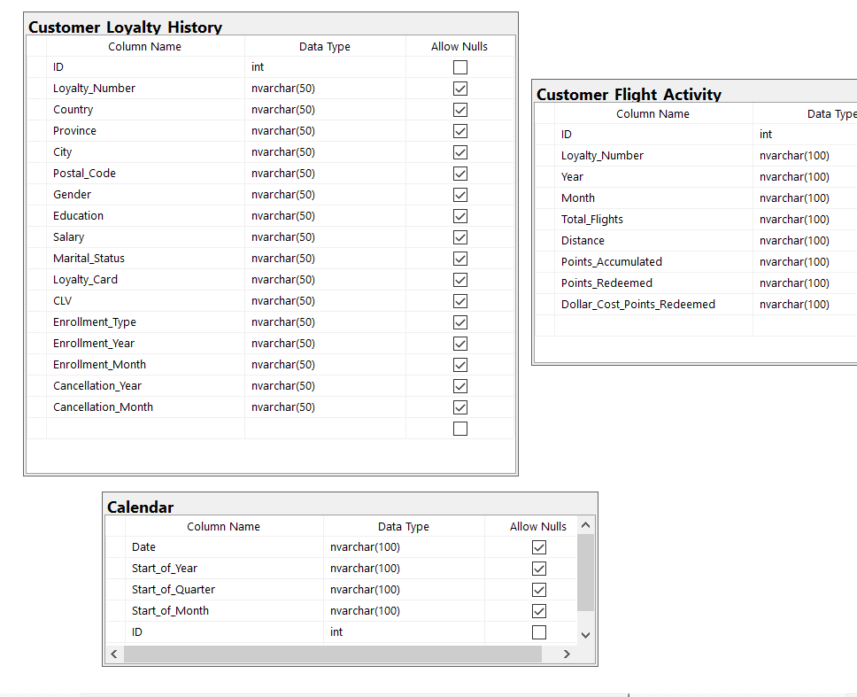
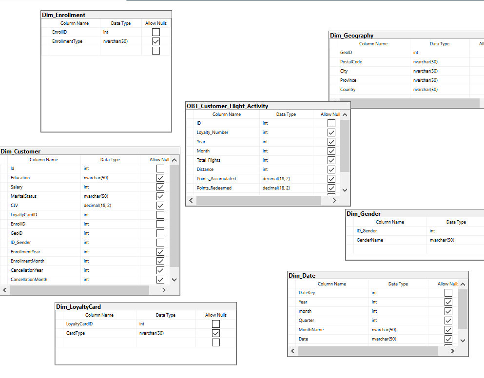
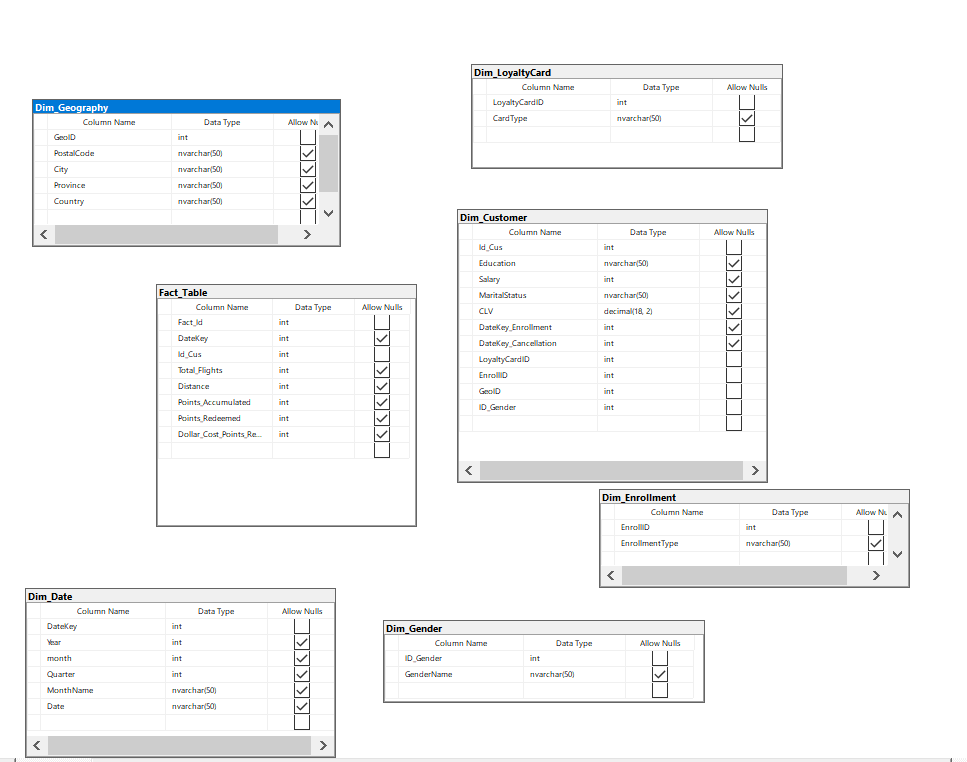

# ✈️ Customer Loyalty Data Warehouse

A complete **End-to-End Data Warehouse** solution for an airline customer loyalty program, built using **SQL Server**, **SSIS**, and **Power BI**.

---

## 📌 Project Overview

This project implements a full **ETL pipeline** and **dimensional data model** to analyze customer flight activity, loyalty points, and enrollment behavior across multiple dimensions.

---

## 🏗️ Architecture

The project follows a **3-Layer Architecture**:

```
Source Data
    ↓
[ODS] Operational Data Store → Raw data loaded from source systems
    ↓
[STG] Staging Layer          → Cleaned & standardized data
    ↓
[DWH] Data Warehouse         → Star Schema for analytics
```

---

## 🗂️ Data Model

### Fact Table
| Column | Type | Description |
|--------|------|-------------|
| Fact_Id | int | Primary Key |
| DateKey | int | FK → Dim_Date |
| Id_Cus | int | FK → Dim_Customer |
| Total_Flights | int | Number of flights |
| Distance | int | Total distance flown |
| Points_Accumulated | int | Loyalty points earned |
| Points_Redeemed | int | Loyalty points used |
| Dollar_Cost_Points_Redeemed | int | Dollar value of redeemed points |

### Dimension Tables
- **Dim_Customer** – Customer demographics and loyalty info
- **Dim_Date** – Date dimension (Year, Month, Quarter)
- **Dim_Geography** – Location data (Country, Province, City)
- **Dim_LoyaltyCard** – Card type classification
- **Dim_Enrollment** – Enrollment type details
- **Dim_Gender** – Gender lookup

---

## 🛠️ Tech Stack

| Tool | Purpose |
|------|---------|
| SQL Server | Database engine |
| SSIS | ETL Pipeline (Extract, Transform, Load) |
| Power BI | Data visualization & dashboards |
| T-SQL | Data transformation & stored procedures |

---

## 📊 Key Analytics

- 📈 Total flights & distance trends over time
- 🏆 Top customers by loyalty points accumulated
- 🗺️ Geographic distribution of customers
- 💳 Loyalty card type analysis
- 📅 Enrollment & cancellation trends by month/year

---

## 📁 Project Structure

```
Customer-Loyalty-DWH/
│
├── kero Task/          # SSIS project (ETL packages)
├── Task kero/          # Additional ETL components
├── Task.pbix           # Power BI dashboard
├── STG.png             # Staging layer schema
├── ODS.png             # ODS layer schema
├── DWH.png             # Data Warehouse schema
└── kero Task.sln       # Visual Studio solution file
```

---

## 🖼️ Database Schemas

### Operational Data Store (ODS)


### Staging Layer (STG)


### Data Warehouse (DWH)


---

## 👤 Author

**Mohamed Abdelhakim**  
Data Engineer | BI Developer  
🔗 [GitHub](https://github.com/MohamedAbdelhakim1)

---

## 📄 License

This project is open source and available under the [MIT License](LICENSE).
